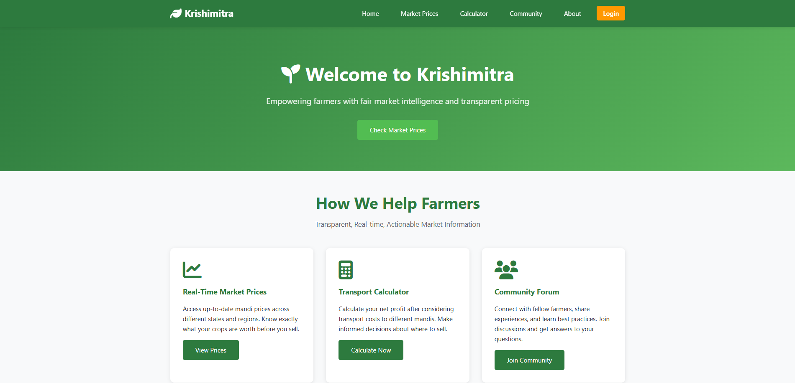

# 🌾 Krishimitra - Farmer Market Intelligence Platform

A comprehensive Flask-based web application designed to empower Indian farmers with transparent market pricing information, transport cost calculations, and data-driven decision-making tools.

---

## Table of Contents

- [Overview](#overview)
- [Features](#features)
- [Tech Stack](#tech-stack)
- [Project Structure](#project-structure)
- [Installation](#installation)
- [Usage](#usage)
- [API & Data Sources](#api-and-data-sources)
- [Acknowledgments](#acknowledgments)
- [Inspiration](#inspiration)

---

## Overview

**Krishimitra** ("Farmer's Friend") addresses the critical information asymmetry in Indian agricultural markets. Farmers often lack real-time price data across different mandis, leading to exploitation by middlemen and suboptimal selling decisions.



### Problem Statement

- **Lack of Price Transparency**: Farmers don't know the best markets to sell their produce
- **High Transport Costs**: No tools to calculate if transporting to distant mandis is profitable
- **Information Gap**: Limited access to historical price trends and market intelligence

### Our Solution

Krishimitra aggregates real-time market prices from eNAM (National Agriculture Market), provides transport cost calculators, visualizes price trends, and offers a platform for farmers to share market insights.

---

## Features

### **Live Market Prices**

- Real-time scraping from eNAM's 1,000+ integrated mandis
- Filter by **State** and **Commodity** (193+ crops)
- Display Min/Modal/Max prices per quintal
- Arrival quantities and trade volumes

### **Data Visualization**

- **Historical Price Trends**: Line charts showing 6-month price movements
- **State vs National Comparison**: Bar charts comparing regional prices
- **Top 5 Market Opportunities**: Identify highest-paying mandis

### **Transport Cost Calculator**

- Calculate net profit after transport expenses
- Factor in distance, fuel costs, and commodity prices
- Compare profitability across multiple mandis
- Interactive charts for opportunity comparison

### **User Management**

- Secure authentication system with password hashing
- Role-based access (Farmer, Trader, NGO)
- User dashboard with activity tracking
- Profile management

### **Crowdsourced Data Input**

- Farmers can submit sale prices from local mandis
- Helps validate official data
- Community-driven price intelligence

### **Community Forum**

- Share market insights and experiences
- Discussion threads by crop and region
- Like/comment functionality (planned)

### **Government Schemes**

- Information about PM-KISAN, crop insurance, and subsidies
- Eligibility criteria and application links

---

## Tech Stack

### Backend

- **Framework**: Flask 3.0.0
- **Database**: SQLAlchemy with SQLite (PostgreSQL for production)
- **Authentication**: Flask-Login with Werkzeug password hashing
- **Web Scraping**: Selenium 4.15.2 + BeautifulSoup4

### Frontend

- **Template Engine**: Jinja2
- **Styling**: Custom CSS with responsive design
- **JavaScript**: Vanilla JS for interactivity
- **Charts**: Chart.js for data visualization

### Data Sources

- **eNAM Live Prices**: https://enam.gov.in/web/dashboard/live_price
- **Historical Data**: Agmarknet India 2024-2025 CSV dataset https://www.kaggle.com/datasets/anishaman07/agmarknet-india-commodity-prices-oct24-aug25
- **Commodity Mapping**: Custom JSON file

### DevOps

- **Version Control**: Git/GitHub
- **Deployment**: Planned for AWS/Heroku/Render
- **Environment**: Python virtual environment

---

## Project Structure

```
krishimitra/
│
├── app.py # Main Flask application (800+ lines)
├── models.py # SQLAlchemy database models
├── requirements.txt # Python dependencies
├── README.md # Project documentation
│
├── data/ # Data files
│   ├── agmarknet_india_historical_prices_2024_2025.csv
│   ├── commodity_mapping.json # Commodity name standardization
│   └── commodity_crop.json # Commodity name standardization
│
├── images/ #Snapshots of UI and generated plots(if any)
│   └── home_page.png
│
├── instance/ # SQLite database directory
│   └── krishimitra.db # User and transaction data
│
├── static/ # Static assets
│   ├── css/
│   │   └── style.css # Main stylesheet
│   └── js/
│       └── main.js # Frontend JavaScript
│
└── templates/ # Jinja2 HTML templates
    ├── base.html # Base template with navbar/footer
    ├── home.html # Landing page
    ├── prices.html # Market prices with charts
    ├── transport_calculator.html # Transport cost calculator
    ├── community.html # Discussion forum
    ├── login.html # User login
    ├── register.html # User registration
    ├── dashboard.html # User dashboard
    ├── profile.html # User profile
    ├── contact.html # Contact form
    └── terms_privacy.html # Legal pages
```

---

## Installation

### Prerequisites

- Python 3.8 or higher
- pip package manager
- Chrome/Chromium browser (for Selenium)
- Git

### Step-by-Step Setup

1. **Clone the repository**

```bash
git clone https://github.com/riddhankur000/Krishimitra.git
cd Krishimitra
```

2. **Create virtual environment**

```bash
python -m venv venv

On Windows
venv\Scripts\activate

On macOS/Linux
source venv/bin/activate
```

3. **Install dependencies**

```bash
pip install -r requirements.txt
```

4. **Run the application**

```bash
python app.py
```

5. **Open browser**

```
http://127.0.0.1:5000
```

---

## Usage

### For Farmers

1. **Register/Login**: Create an account with your details
2. **Check Prices**: Navigate to "Market Prices" to see real-time rates
3. **Filter Data**: Select your state and crop to see relevant prices
4. **Calculate Transport**: Use the Transport Calculator to compare mandi profitability
5. **Submit Data**: Share your local mandi prices to help the community
6. **View Trends**: Analyze historical price charts to time your sales

### For Traders/NGOs

1. **Market Intelligence**: Access comprehensive price data across states
2. **Bulk Analysis**: Download data for further analysis (planned)
3. **Scheme Information**: Help farmers access government benefits

---

## API and Data Sources

### Web Scraping Implementation

**Example: Extracting live prices from eNAM**

```python
def extract_commodity_list():
driver = webdriver.Chrome(service=service, options=chrome_options)
url = 'https://enam.gov.in/web/dashboard/live_price'
driver.get(url)

text
# Click commodity radio and select "-- All --"
commodity_radio.click()
select_commodity.select_by_visible_text("-- All --")

# Parse table data
soup = BeautifulSoup(driver.page_source, 'html.parser')
# Extract State, APMC, Commodity, Min/Modal/Max prices

return dataframe
```

### Data Processing

- **Historical Data**: 2024-2025 Agmarknet CSV with 500,000+ price records
- **Commodity Mapping**: Standardizes crop names across data sources
- **Price Aggregation**: Calculates state-level and national averages

---

## Acknowledgments

- **eNAM**: For providing open access to market price data
- **Agmarknet**: For historical agricultural price datasets
- **Indian Government**: For initiatives like Digital India enabling such platforms
- **Farmers**: The backbone of our nation, for whom this platform exists
- **Contributors**: Everyone who has helped build and improve Krishimitra

---

## Inspiration

> _"The farmer is the only man in our economy who buys everything at retail, sells everything at wholesale, and pays the freight both ways."_ - John F. Kennedy

This project aims to level the playing field by giving farmers the same market intelligence that traders have always had.
